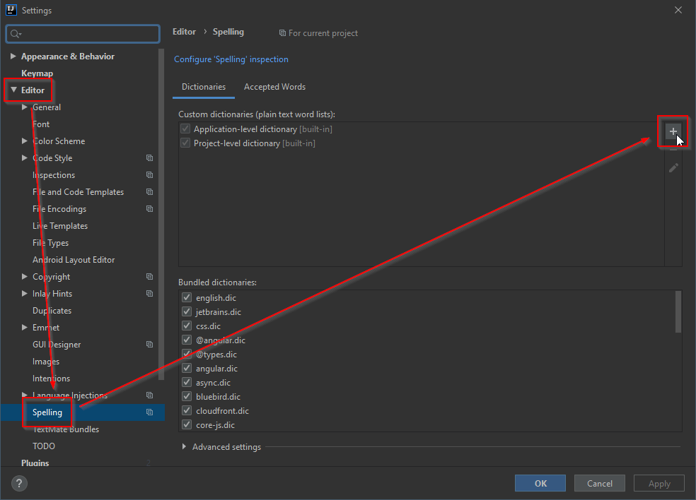

= [IntelliJ] Ajouter un dictionnaire

* Récupérer le dictionnaire correspondant à la langue sur link:http://www.winedt.org/dict.html[le site de WinEdt]

* Convertir le dictionnaire en UTF-8

* Ajouter le dictionnaire à IntelliJ

* link:https://stackoverflow.com/questions/1949976/where-to-find-dictionaries-for-other-languages-for-intellij[stackoverflow - Where to find dictionaries for other languages for IntelliJ ?]
* link:https://web.archive.org/web/20180115081610/http://blog.novoj.net/2010/11/07/how-to-add-your-own-dictionary-to-intellij-idea-spellchecker/[Myšlenky dne otce Fura - How to add your own dictionary to IntelliJ Idea Spellchecker]